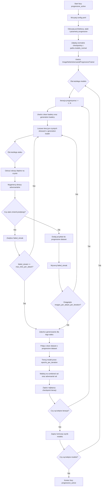

# Progresywne uczenie adversarialne dla ImageNette

## Cel i motywacja

Progresywne uczenie adversarialne jest wariantem treningu odpornościowego, w którym model nie otrzymuje jednorazowo stałego zbioru przykładów adversarialnych. Zamiast tego przykłady są generowane iteracyjnie na podstawie aktualnego stanu modelu, a następnie dokładane do rosnącego zbioru treningowego. Dzięki temu model jest regularnie wystawiany na nowe warianty perturbacji, które pozostają skuteczne wobec bieżących wag sieci.

W klasycznym treningu adversarialnym istnieje ryzyko, że model szybko dopasuje się do ograniczonego, wcześniej wygenerowanego zbioru ataków. Podejście progresywne ogranicza ten problem, ponieważ po każdej rundzie fine-tuningu ataki są generowane ponownie. Zbiór adversarialny staje się historią słabości modelu z kolejnych etapów treningu, a nie pojedynczą migawką podatności sprzed uczenia.

Implementacja znajduje się w `imagenette_lab/training/imagenette_adversarial_progressive_trainer.py`, a etap eksperymentu uruchamiany jest z fazy `progressive_active` w `experiments/imagenette_full_research/runner.py`.

## Zakres eksperymentu

Aktualna konfiguracja eksperymentu jest zdefiniowana w `experiments/imagenette_full_research/config.yaml`.

### Faza pipeline'u

Włączona faza:

```yaml
run:
  phases:
    - progressive_active
```

Oznacza to, że runner uruchamia aktywne progresywne uczenie adversarialne. Walidacja progresywna, direct attacks, trening pasywny, detekcja szumu i transferability są obecnie zakomentowane.

### Modele

Eksperyment jest wykonywany dla architektur:

```yaml
training:
  config_name: advanced
  full_finetune: true
  architectures:
    - resnet18
    - densenet121
    - efficientnet_b0
    - mobilenet_v2
    - swin_t
    - inception_v3
```

Ważne: faza `progressive_active` nie tworzy świeżych modeli ImageNet od zera. Dla każdej architektury ładowany jest wcześniej wytrenowany checkpoint normalny z katalogu `paths.models_normal`, zgodnie ze wzorcem:

```text
final_research/models/normal/<arch>_advanced.pt
```

Dopiero tak załadowany model jest dalej trenowany progresywnie na mieszaninie danych czystych i adversarialnych.

### Ataki

Lista ataków pochodzi z sekcji `attacks.names`:

```yaml
attacks:
  names:
    - APGD
    - APGDT
    - BIM
    - CW
    - DeepFool
    - DIFGSM
    - EADEN
    - EADL1
    - EOTPGD
    - FAB
    - FFGSM
    - FGSM
    - GN
    - Jitter
    - MIFGSM
    - NIFGSM
    - PGD
    - PGDL2
    - PGDRS
    - PGDRSL2
    - RFGSM
    - SINIFGSM
    - SPSA
    - TIFGSM
    - TPGD
    - UPGD
    - VMIFGSM
    - VNIFGSM
    - OnePixel
    - Pixle
    - Square
```

Dla każdego ataku trainer próbuje wygenerować określoną liczbę skutecznych przykładów adversarialnych w każdej iteracji.

### Parametry progresywnego treningu

Sekcja `progressive` steruje główną dynamiką eksperymentu:

```yaml
progressive:
  learning_rate: 0.0001
  iterations: 30
  epochs_per_iteration: 50
  batch_size: 32
  images_per_attack_per_iteration: 10
  validation_images_per_attack_per_iteration: 2
  max_tries_per_attack: 50
  early_stopping_patience: 7
  scheduler_type: step
  weight_decay: 0.0001
  gradient_clip_norm: 1.0
  save_generated_images: true
```

Znaczenie parametrów:

- `learning_rate`: współczynnik uczenia używany w każdej iteracji progresywnej.
- `iterations`: liczba rund progresywnego generowania i trenowania.
- `epochs_per_iteration`: maksymalna liczba epok fine-tuningu wykonywana po wygenerowaniu nowych przykładów w danej iteracji.
- `batch_size`: rozmiar batcha dla treningu i walidacji na połączonym zbiorze.
- `images_per_attack_per_iteration`: docelowa liczba skutecznych przykładów adversarialnych generowanych dla każdego ataku na split treningowy w jednej iteracji.
- `validation_images_per_attack_per_iteration`: docelowa liczba skutecznych przykładów adversarialnych generowanych dla każdego ataku na split walidacyjny w jednej iteracji.
- `max_tries_per_attack`: limit kolejnych nieudanych prób dla danego ataku. Jeżeli w ostatnich `X` próbach nie uda się wygenerować skutecznego przykładu, generowanie dla tego ataku jest przerywane.
- `early_stopping_patience`: liczba epok bez poprawy, po której trening w bieżącej iteracji może zostać zatrzymany.
- `scheduler_type`: typ scheduler'a uczenia, w tym przypadku `step`.
- `weight_decay`: regularyzacja L2 w optymalizatorze.
- `gradient_clip_norm`: maksymalna norma gradientu używana do stabilizacji treningu.
- `save_generated_images`: zapisuje wygenerowane obrazy adversarialne do katalogu eksperymentu.

## Metoda działania

### 1. Inicjalizacja modeli

Runner dla każdej architektury:

1. Buduje ścieżkę do normalnego checkpointu: `final_research/models/normal/<arch>_advanced.pt`.
2. Ładuje model przez `load_model_imagenette(...)`.
3. Przekazuje załadowany model do `ImageNetteAdversarialProgressiveTrainer`.
4. Przygotowuje ścieżkę zapisu wyniku progresywnego: `final_research/models/progressive_active/<arch>_progressive_adv.pt`.

W praktyce oznacza to, że progresywny etap jest kontynuacją normalnego treningu, a nie treningiem od bazowych wag ImageNet.

### 2. Generowanie przykładów adversarialnych

Na początku każdej iteracji trainer korzysta z czystych loaderów ImageNette:

- `generation_train_loader` i `generation_test_loader` z `batch_size=1` oraz `shuffle=True` do generowania nowych ataków,
- `clean_train_loader` i `clean_test_loader` z `batch_size=batch_size` oraz `shuffle=False` do budowania czystej części zbioru treningowego i walidacyjnego.

Oznacza to, że wybór oraz kolejność czystych obrazów używanych do ataku są losowane przez loader generacyjny. Trainer nie atakuje deterministycznie pierwszych `N` obrazów z katalogu. Dla każdego ataku przechodzi po czystym loaderze w losowej kolejności i zbiera skuteczne przykłady do momentu osiągnięcia limitu `images_per_attack_per_iteration` albo przerwania przez `max_tries_per_attack`. W praktyce dwa uruchomienia tego samego eksperymentu mogą wygenerować inny zestaw przykładów adversarialnych, jeżeli nie ustawiono jawnie seedów dla `torch`, `random`, `numpy`, generatorów `DataLoader` oraz losowości samych ataków.

Losowość dotyczy przede wszystkim doboru kandydatów do ataku i kolejności ich przetwarzania. Dodatkowo część algorytmów ataku posiada własny komponent stochastyczny, więc nawet dla tego samego obrazu wynik perturbacji może zależeć od stanu generatorów losowych.

Dla każdego ataku wykonywana jest następująca procedura:

1. Dla bieżącego ataku tworzona jest instancja przez `AttackFactory.get_attack(attack_name, model)`.
2. Loader generacyjny zwraca czysty obraz i etykietę.
3. Aktualny model klasyfikuje czysty obraz.
4. Jeżeli model myli się na czystym obrazie, próbka jest odrzucana i nie jest używana do generowania przykładu adversarialnego.
5. Dla poprawnie sklasyfikowanego obrazu generowany jest przykład adversarialny.
6. Wynik ataku jest przycinany do zakresu `[0, 1]` przez `normalize_adversarial_image(...)`.
7. Model klasyfikuje wygenerowany obraz adversarialny.
8. Przykład jest uznany za skuteczny, jeśli predykcja modelu po ataku różni się od etykiety.
9. Skuteczne przykłady są zapisywane w pamięci jako `(adv_image, label)`.
10. Dla skutecznych przykładów zapisywany jest także `AttackResult`, który służy do obliczania średnich metryk odległości perturbacji.
11. Jeżeli `save_generated_images: true`, obraz jest także zapisywany na dysku jako PNG.

Mechanizm `max_tries_per_attack` działa jako limit kolejnych porażek. Każdy skuteczny przykład zeruje licznik nieudanych prób, a każda nieskuteczna próba zwiększa licznik `failed_streak`. Jeżeli licznik osiągnie wartość z konfiguracji, generowanie dla danego ataku zostaje zakończone.

Warto podkreślić, że `max_tries_per_attack` nie jest limitem całkowitej liczby prób. Jest to limit kolejnych nieudanych prób. Jeżeli atak regularnie znajduje skuteczne przykłady, licznik jest resetowany po każdym sukcesie i proces może trwać dłużej. Jeżeli przez dłuższą serię kandydatów nie udaje się znaleźć skutecznego przykładu, generowanie dla tego ataku kończy się wcześniej.

### 3. Kumulowanie danych

Trainer utrzymuje dwa rosnące zbiory:

- `progressive_train_dataset`: skuteczne przykłady adversarialne dla treningu,
- `progressive_test_dataset`: skuteczne przykłady adversarialne dla walidacji.

Po każdej iteracji nowe przykłady są dokładane do istniejących list. Następnie tworzony jest połączony zbiór:

```text
combined_train_dataset = clean_train_dataset + progressive_train_dataset
combined_val_dataset   = clean_val_dataset   + progressive_test_dataset
```

W efekcie model w kolejnych iteracjach trenuje na coraz większym zbiorze, który zawiera zarówno czyste dane, jak i wszystkie skuteczne przykłady adversarialne wygenerowane w poprzednich rundach.

Nowo wygenerowane przykłady nie zastępują starszych przykładów adversarialnych. Są do nich dokładane. Oznacza to, że model w iteracji `k` widzi czyste dane oraz sumę skutecznych ataków wygenerowanych w iteracjach `1..k`. Zbiór adversarialny pełni więc rolę pamięci historycznych podatności modelu.

Czysty zbiór danych jest dołączany w całości przez `clean_train_loader.dataset` i `clean_test_loader.dataset`, natomiast część adversarialna jest skumulowaną listą tensorów wygenerowanych aktywnie podczas treningu. Przy każdej iteracji tworzony jest nowy `ConcatDataset`, a następnie nowy `DataLoader`. Loader treningowy dla połączonego zbioru używa `shuffle=True`, więc kolejność batchy w trakcie fine-tuningu również jest losowa.

### 4. Trening w iteracji

Po przygotowaniu zbioru danych wywoływana jest metoda `Training.train_imagenette_adversarial_progressive(...)`. Dla każdej iteracji:

1. Tworzony jest nowy optymalizator `Adam`.
2. Tworzony jest scheduler zgodny z konfiguracją.
3. Model jest trenowany przez maksymalnie `epochs_per_iteration` epok.
4. Walidacja odbywa się na połączonym zbiorze czystym i adversarialnym.
5. Osobno monitorowana jest walidacja na skumulowanym zbiorze adversarialnym.
6. Najlepszy checkpoint danej iteracji jest zapisywany z sufiksem iteracji.

Wagi modelu nie są resetowane pomiędzy iteracjami. Każda kolejna iteracja kontynuuje fine-tuning modelu po poprzedniej iteracji.

### 5. Zapisywane artefakty

W typowym uruchomieniu runner zapisuje:

- progresywne checkpointy modeli: `final_research/models/progressive_active/`,
- wygenerowane obrazy adversarialne: `final_research/data/attacks/progressive_active/`,
- logi TensorBoard: `final_research/runs/adversarial_training_progressive/`.

Jeżeli `save_generated_images` jest włączone, obrazy są zapisywane w strukturze:

```text
<attacked_images_folder>/<train|test>/<model_progressive_adv>/<attack>/<label>/progressive_iter<it>_<timestamp>.png
```

## Diagram przepływu



## Interpretacja metody

Najważniejszą cechą tej procedury jest sprzężenie zwrotne pomiędzy modelem i generatorem ataków. Model po każdej iteracji zmienia swoje granice decyzyjne, więc kolejne ataki są generowane względem nowszej, potencjalnie odporniejszej wersji modelu. Jeżeli atak nadal znajduje skuteczne perturbacje, przykłady trafiają do zbioru treningowego. Jeżeli przez dłuższą serię prób atak nie znajduje skutecznego przykładu, mechanizm `max_tries_per_attack` ogranicza koszt obliczeniowy i przechodzi dalej.

Metoda działa więc jak aktywne wzmacnianie odporności: model jest uczony na czystych danych oraz na stale rozszerzanej pamięci przykładów, które w przeszłości były dla niego trudne. Dzięki temu końcowy model powinien zachować kompetencję klasyfikacji czystych obrazów, a jednocześnie poprawiać odporność na szeroką rodzinę ataków adversarialnych.

## Ograniczenia i założenia

- Generowane są wyłącznie przykłady z obrazów poprawnie sklasyfikowanych przed atakiem.
- Obrazy kandydackie do ataku są pobierane z loaderów z `shuffle=True`, więc bez kontrolowanych seedów dobór i kolejność próbek nie są deterministyczne.
- Zbiór adversarialny rośnie w pamięci procesu, dlatego koszt pamięci zwiększa się wraz z liczbą iteracji i liczbą ataków.
- `max_tries_per_attack` jest heurystyką kosztu obliczeniowego: mniejsza wartość przyspiesza eksperyment, ale może zmniejszyć liczbę znalezionych skutecznych przykładów.
- Skuteczność treningu zależy od różnorodności ataków w `attacks.names`; zbyt wąski zestaw ataków może prowadzić do odporności wyspecjalizowanej tylko pod konkretne metody.
- Każda iteracja tworzy nowy optymalizator i scheduler, ale kontynuuje trening tych samych wag modelu.
