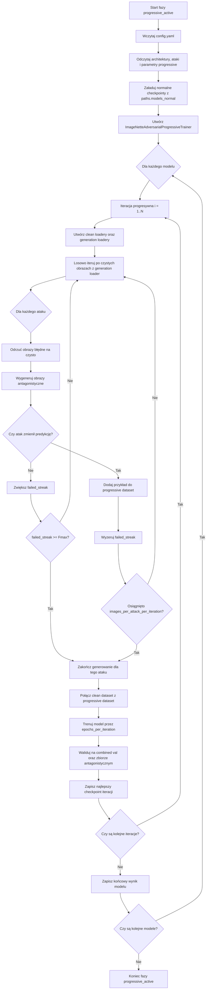

# Progresywne uczenie antagonistyczne dla ImageNette

## Cel i motywacja

Progresywne uczenie antagonistyczne jest wariantem treningu odpornościowego, w którym model nie otrzymuje jednorazowo stałego zbioru przykładów antagonistycznych. Zamiast tego przykłady są generowane iteracyjnie na podstawie aktualnego stanu modelu, a następnie dokładane do rosnącego zbioru treningowego. Dzięki temu model jest regularnie wystawiany na nowe warianty perturbacji, które pozostają skuteczne wobec bieżących wag sieci.

W klasycznym treningu antagonistycznym istnieje ryzyko, że model szybko dopasuje się do ograniczonego, wcześniej wygenerowanego zbioru ataków. Podejście progresywne ogranicza ten problem, ponieważ po każdej rundzie fine-tuningu ataki są generowane ponownie. Zbiór antagonistyczny staje się historią słabości modelu z kolejnych etapów treningu, a nie pojedynczą migawką podatności sprzed uczenia.

Jednym z głównych celów tej metody jest uzyskanie niewrażliwości modelu na subtelne, celowo zaprojektowane zmiany w obrazie. Ataki antagonistyczne często nie polegają na semantycznej zmianie treści obrazu, lecz na wprowadzeniu niewielkich perturbacji, które są słabo zauważalne dla człowieka, ale znacząco zmieniają odpowiedź modelu. Progresywne uczenie antagonistyczne ma stopniowo zmniejszać wpływ takich wyinżynierowanych modyfikacji, ponieważ model jest wielokrotnie trenowany na przykładach, które wcześniej wykorzystywały jego aktualne słabości.

Dodatkową motywacją jest zwiększenie kosztu adaptacji po stronie atakującego. Jeżeli atakujący wie, że model był trenowany antagonistycznie, może próbować odtworzyć podobny trening i przygotować atak przeciwko modelowi o zbliżonej odporności. W przypadku pojedynczego etapu treningu antagonistycznego taka strategia jest relatywnie prostsza do przewidzenia. W przypadku treningu progresywnego atakujący musiałby jednak odtworzyć nie tylko samą metodę ataku, lecz także sekwencję kolejnych iteracji, losowy dobór próbek, skuteczne przykłady zaakceptowane w każdej rundzie oraz zmiany wag modelu po każdej fazie douczania.

Można interpretować to jako problem liczby „refleksji” lub poziomów adaptacji. Model po jednej iteracji jest odporny na pewien zbiór ataków, więc atakujący może dostosować się do tej wersji. Po wielu iteracjach model uwzględnia jednak historię kolejnych prób obejścia odporności. Im dalsza iteracja procesu, tym trudniej założyć, że atakujący odtworzy dokładnie tę samą ścieżkę treningową i przygotuje perturbację skuteczną względem końcowego modelu. Z tego powodu ataki projektowane względem wcześniejszych lub mniej zaadaptowanych wersji modelu powinny stawać się coraz mniej skuteczne.

Metoda może również ograniczać przenaszalność ataków między modelami. Jeżeli model staje się mniej wrażliwy na subtelne, specjalnie zaprojektowane zmiany konkretnych pikseli, to perturbacje wygenerowane dla jednej architektury lub jednej wersji modelu powinny rzadziej zachowywać skuteczność po przeniesieniu na inny model. Innymi słowy, progresywne uczenie antagonistyczne nie tylko wzmacnia odporność wobec ataków generowanych bezpośrednio na dany model, ale może także zmniejszać użyteczność perturbacji jako uniwersalnych lub transferowalnych wzorców błędu.

Implementacja znajduje się w `imagenette_lab/training/imagenette_adversarial_progressive_trainer.py`, a etap eksperymentu uruchamiany jest z fazy `progressive_active` w `experiments/imagenette_full_research/runner.py`.

## Wkład metody

Wprowadzona metoda stanowi aktywne rozszerzenie klasycznego uczenia antagonistycznego. Jej główny wkład polega na tym, że zbiór przykładów antagonistycznych nie jest traktowany jako statyczny zasób przygotowany przed treningiem, lecz jako dynamicznie rozwijana pamięć przypadków, które były skuteczne wobec kolejnych wersji modelu.

Najważniejsze elementy metody:

- **Generowanie ataków względem aktualnego modelu**: w każdej iteracji przykłady antagonistyczne są tworzone na podstawie bieżących wag sieci, a nie względem modelu sprzed rozpoczęcia treningu odpornościowego.
- **Kumulowanie historycznych słabości modelu**: skuteczne przykłady z poprzednich iteracji nie są usuwane. Trafiają do rosnącego zbioru, który reprezentuje historię podatności modelu.
- **Aktywny dobór trudnych przykładów**: do zbioru antagonistycznego trafiają wyłącznie przykłady, które faktycznie zmieniły decyzję modelu. Metoda nie zakłada, że każda perturbacja jest równie wartościowa treningowo.
- **Kontrola kosztu przez cierpliwość Fmax**: metoda ogranicza liczbę kolejnych nieskutecznych prób, dzięki czemu ataki, które przestają znajdować błędy modelu, nie dominują czasu obliczeniowego eksperymentu.
- **Jednoczesne monitorowanie danych czystych i antagonistycznych**: trening odbywa się na zbiorze mieszanym, a walidacja obejmuje zarówno połączony zbiór walidacyjny, jak i skumulowaną część antagonistyczną.
- **Zwiększenie kosztu adaptacji atakującego**: końcowy model jest wynikiem wielu iteracji generowania, selekcji i douczania, więc jego odtworzenie przez atakującego wymagałoby rekonstrukcji całej ścieżki treningowej, a nie tylko znajomości architektury i pojedynczej procedury ataku.
- **Potencjalne ograniczenie przenaszalności ataków**: model uczony na wielu iteracjach subtelnych perturbacji powinien słabiej reagować na specyficzne wzorce pikselowe, co może zmniejszać skuteczność ataków przenoszonych z innych modeli.

Tak zdefiniowany proces można traktować jako formę aktywnego curriculum learning, w którym poziom trudności danych rośnie wraz z modelem. Model sam, poprzez swoje aktualne błędy, współdecyduje o tym, jakie przykłady zostaną dołączone do kolejnych etapów treningu.

## Różnica względem klasycznego uczenia antagonistycznego

Klasyczne uczenie antagonistyczne najczęściej przyjmuje jedną z dwóch form. Pierwsza polega na wcześniejszym wygenerowaniu zbioru przykładów antagonistycznych i późniejszym trenowaniu modelu na tym stałym zbiorze. Druga generuje przykłady on-the-fly w trakcie epok treningowych, ale zwykle nie zachowuje długoterminowej pamięci wygenerowanych wcześniej przykładów.

Proponowane podejście różni się od obu wariantów:

- W przeciwieństwie do treningu na statycznym zbiorze, przykłady są generowane ponownie w każdej iteracji, już po zmianie wag modelu.
- W przeciwieństwie do prostego generowania on-the-fly, skuteczne przykłady są kumulowane i pozostają dostępne w kolejnych iteracjach.
- Zbiór treningowy rośnie progresywnie, zamiast być stałą mieszaniną danych czystych i antagonistycznych.
- Ataki są filtrowane przez skuteczność: do pamięci trafiają tylko te przykłady, które faktycznie spowodowały błędną predykcję.
- Metoda naturalnie tworzy sekwencję coraz trudniejszych etapów, ponieważ ataki są generowane względem coraz bardziej dostrojonego modelu.

W efekcie klasyczne uczenie antagonistyczne odpowiada na pytanie: „jak nauczyć model odporności na znany zbiór perturbacji?”, natomiast progresywne uczenie antagonistyczne odpowiada na pytanie: „jak iteracyjnie identyfikować i zapamiętywać nowe słabości modelu podczas wzmacniania jego odporności?”.

## Hipoteza badawcza

Hipoteza badawcza stojąca za metodą jest następująca:

> Model trenowany na skumulowanym zbiorze przykładów antagonistycznych, generowanych iteracyjnie względem kolejnych stanów własnych wag, osiągnie wyższą odporność na szerokie spektrum ataków niż model trenowany wyłącznie na danych czystych lub model trenowany na statycznym zbiorze przykładów antagonistycznych.

Uzasadnienie tej hipotezy wynika z adaptacyjnego charakteru procedury. Jeżeli model po danej iteracji przestaje być podatny na część wcześniejszych perturbacji, kolejne ataki są generowane już względem jego nowszej wersji. Proces powinien więc przesuwać uwagę treningu z łatwych, wcześniej opanowanych przypadków na te przykłady, które nadal odsłaniają aktualne słabości modelu.

Dodatkowo kumulowanie wcześniejszych skutecznych przykładów zmniejsza ryzyko zapominania odporności uzyskanej w poprzednich iteracjach. Model nie trenuje wyłącznie na najnowszym zestawie ataków, lecz na pełnej historii znalezionych przykładów antagonistycznych.

Drugim elementem hipotezy jest założenie, że skuteczność ataków projektowanych względem wcześniejszych etapów treningu będzie spadać wraz z odległością od końcowej iteracji modelu. Model po wielu rundach powinien być mniej wrażliwy na małe, celowo zaprojektowane zmiany w obrazie, ponieważ takie zmiany były wielokrotnie odkrywane, filtrowane i włączane do zbioru uczącego. Dotyczy to również silnego scenariusza ataku białej skrzynki: nawet jeśli atakujący zna architekturę i aktualne wagi modelu, końcowy model powinien mieć mniejszą podatność na subtelne perturbacje, ponieważ jego proces treningowy był systematycznie wzmacniany przykładami tego typu.

W tym sensie progresywność pełni także funkcję utrudnienia dla atakującego. Im więcej iteracji aktywnego uczenia antagonistycznego, tym więcej etapów adaptacji należałoby odtworzyć, aby przygotować atak odpowiadający końcowej wersji modelu. Prawdopodobieństwo, że atakujący dokładnie powtórzy wieloetapową ścieżkę generowania przykładów, selekcji skutecznych perturbacji i douczania modelu, jest niższe niż w przypadku jednorazowego treningu antagonistycznego.

Trzecim elementem hipotezy jest spadek przenaszalności ataków między modelami. Jeżeli końcowy model jest mniej podatny na lokalne, wyinżynierowane zmiany pikseli, to przykłady antagonistyczne wygenerowane na innym modelu powinny mieć mniejszą szansę wywołania błędnej decyzji. Taki efekt byłby szczególnie istotny w scenariuszach, w których atakujący nie atakuje bezpośrednio końcowego modelu, lecz korzysta z modelu zastępczego i próbuje przenieść perturbację na właściwy system.

## Założenia metody

Metoda opiera się na kilku założeniach dotyczących modelu, danych, ataków oraz kosztu obliczeniowego eksperymentu.

- **Model bazowy powinien mieć sensowną jakość na danych czystych**. Aktywne generowanie przykładów antagonistycznych filtruje próbki błędnie sklasyfikowane przed atakiem. Oznacza to, że metoda zakłada istnienie modelu, który poprawnie rozpoznaje istotną część czystych obrazów i dopiero na tej podstawie można szukać perturbacji zmieniających jego decyzję.

- **Skuteczny przykład antagonistyczny jest wartościowy treningowo**. Jeżeli perturbacja zmienia decyzję modelu dla obrazu poprawnie sklasyfikowanego przed atakiem, to taki przykład ujawnia realną słabość aktualnego modelu. Z tego powodu metoda zapisuje i kumuluje tylko skuteczne przypadki.

- **Słabości modelu zmieniają się po douczaniu**. Po każdej iteracji aktualizowane są wagi modelu, więc wcześniejsze perturbacje mogą przestać być wystarczająco skuteczne. Dlatego nowe ataki są generowane względem bieżącej wersji modelu, a nie wyłącznie raz przed rozpoczęciem treningu.

- **Starsze skuteczne ataki nadal mają wartość**. Nawet jeżeli model po kilku iteracjach staje się odporniejszy, wcześniejsze przykłady antagonistyczne reprezentują historię podatności, której model nie powinien zapomnieć. Z tego powodu zbiór antagonistyczny jest kumulowany, a nie nadpisywany w każdej iteracji.

- **Mieszanina danych czystych i antagonistycznych jest konieczna dla zachowania jakości klasyfikacji**. Celem metody nie jest wyłącznie obniżenie skuteczności ataków, ale także utrzymanie kompetencji modelu na obrazach niezmodyfikowanych. Dlatego trening odbywa się na połączonym zbiorze czystym i antagonistycznym.

- **Subtelne perturbacje można częściowo neutralizować przez ekspozycję iteracyjną**. Metoda zakłada, że wielokrotne uczenie na przykładach zawierających małe, celowo zaprojektowane zmiany pikseli zmniejsza wrażliwość modelu na podobne modyfikacje w przyszłości.

- **Wiele iteracji zwiększa koszt adaptacji atakującego**. Końcowy model jest wynikiem całej ścieżki generowania ataków, selekcji skutecznych przykładów i douczania. Atakujący, który chciałby przygotować równie dopasowany atak, musiałby odtworzyć nie tylko architekturę i wagi, ale także wieloetapowy proces adaptacji.

- **Cierpliwość Fmax jest heurystyką kosztu obliczeniowego**. Długa seria kolejnych nieskutecznych prób sugeruje, że dany atak w aktualnej iteracji przestaje efektywnie znajdować nowe słabości modelu. Cierpliwość Fmax pozwala zakończyć takie generowanie wcześniej i przenieść zasoby obliczeniowe na kolejne ataki lub kolejne etapy.

- **Aktywnie wygenerowany zbiór może mieć wartość pasywną**. Zapisane przykłady antagonistyczne mogą być później użyte do uczenia innych modeli, bez ponownego uruchamiania aktywnego procesu generowania ataków.

## Uzasadnienie nazwy metody

Opisywaną w tym dokumencie fazę można określić jako **aktywne progresywne uczenie antagonistyczne**.

Słowo **aktywne** oznacza, że trudne przykłady są generowane w trakcie eksperymentu przez sam proces treningowy. Model nie korzysta wyłącznie z pasywnego, przygotowanego wcześniej zbioru danych. Zamiast tego jego bieżące decyzje są używane do wyboru obrazów, które zostaną zaatakowane, oraz do oceny, czy wygenerowany przykład jest wartościowy.

Słowo **progresywne** odnosi się do iteracyjnego wzrostu zbioru antagonistycznego. Po każdej rundzie generowania i treningu nowe skuteczne przykłady są dokładane do istniejącego zbioru. Kolejne iteracje nie zaczynają od pustej pamięci, lecz rozwijają poprzednie etapy.

Słowo **antagonistyczne** wskazuje, że przykłady treningowe są tworzone przez mechanizmy działające przeciwko modelowi. Ich celem jest znalezienie takich perturbacji obrazu, które prowadzą do błędnej klasyfikacji, a następnie wykorzystanie tych przypadków do wzmocnienia modelu.

Pełna nazwa oddaje więc trzy kluczowe aspekty: aktywne wyszukiwanie błędów, progresywne gromadzenie trudnych przykładów oraz antagonistyczny charakter generowanych perturbacji.

## Aktywna i pasywna odmiana metody

Progresywne uczenie antagonistyczne można podzielić na dwie powiązane odmiany: **aktywną** oraz **pasywną**. Obie korzystają z tej samej idei wzmacniania odporności modelu przez przykłady antagonistyczne, ale różnią się momentem generowania ataków oraz sposobem wykorzystania powstałego zbioru danych.

### Aktywne progresywne uczenie antagonistyczne

Aktywna odmiana jest głównym przedmiotem tego dokumentu i odpowiada fazie `progressive_active`. W tym wariancie generowanie przykładów antagonistycznych oraz douczanie modelu zachodzą w jednej pętli treningowej.

W każdej iteracji:

1. Aktualna wersja modelu jest używana do wygenerowania nowych skutecznych ataków.
2. Przykłady antagonistyczne są filtrowane przez skuteczność, czyli do zbioru trafiają tylko te, które zmieniły predykcję modelu.
3. Nowe przykłady są dopisywane do skumulowanego zbioru antagonistycznego.
4. Ten sam model jest dalej trenowany na danych czystych oraz na powiększonym zbiorze przykładów antagonistycznych.

Kluczową cechą wariantu aktywnego jest sprzężenie zwrotne: model generuje dane treningowe względem własnego aktualnego stanu, a następnie natychmiast uczy się na przykładach, które ujawniły jego bieżące słabości.

### Pasywne progresywne uczenie antagonistyczne

Pasywna odmiana wykorzystuje zbiór danych zapisany podczas aktywnego progresywnego uczenia antagonistycznego, ale nie generuje nowych ataków w trakcie własnego treningu. W tym wariancie aktywny etap pełni rolę generatora danych, a pasywny etap pełni rolę osobnego treningu na gotowym zbiorze.

Proces wygląda następująco:

1. Najpierw uruchamiany jest wariant aktywny, który generuje i zapisuje skuteczne obrazy antagonistyczne na dysku.
2. Następnie tworzony jest nowy model, który nie był wcześniej trenowany progresywnie.
3. Ten nowy model jest uczony na mieszaninie obrazów czystych oraz zapisanych obrazów antagonistycznych pochodzących z aktywnego etapu.
4. Podczas pasywnego treningu nie zachodzi już aktywne wyszukiwanie nowych słabości bieżącego modelu.

Różnica jest więc zasadnicza: w wariancie aktywnym model sam współtworzy dane, na których będzie się dalej uczył, natomiast w wariancie pasywnym model korzysta z gotowego zbioru przykładów antagonistycznych wygenerowanych wcześniej przez inny proces treningowy.

Pasywna odmiana pozwala sprawdzić, czy zbiór antagonistyczny wygenerowany w aktywnym procesie ma wartość transferowalną jako materiał treningowy dla nowego modelu. Innymi słowy, bada ona, czy historia słabości jednego modelu lub jednej procedury aktywnej może poprawić odporność modelu trenowanego później bez aktywnego generowania ataków.

Dodatkową zaletą wariantu pasywnego jest możliwość ponownego użycia oraz agregacji zapisanych obrazów antagonistycznych bez konieczności każdorazowego uruchamiania pełnego aktywnego procesu douczania. Jeżeli zbiór zaatakowanych obrazów został już dostarczony lub wcześniej wygenerowany, można wykorzystać go jako gotowy zasób treningowy dla innego modelu albo włączyć go do szerszego zbioru danych. Pozwala to oddzielić kosztowny etap aktywnego generowania ataków od późniejszego etapu uczenia modeli na danych czystych i zaatakowanych.

Ma to znaczenie praktyczne w sytuacjach, w których aktywne douczanie całego modelu uwzględniającego dodatkowe dane byłoby zbyt kosztowne obliczeniowo lub czasowo. Wariant pasywny umożliwia wtedy wykorzystanie efektów wcześniejszego aktywnego eksperymentu oraz tego z drugiej porcji danych.

## Zakres eksperymentu

Aktualna konfiguracja eksperymentu jest zdefiniowana w `experiments/imagenette_full_research/config.yaml`.

### Faza pipeline'u

Włączona faza:

```yaml
run:
  phases:
    - progressive_active
```

Oznacza to, że runner uruchamia aktywne progresywne uczenie antagonistyczne. Walidacja progresywna, direct attacks, trening pasywny, detekcja szumu i transferability są obecnie zakomentowane.

### Modele

Eksperyment jest wykonywany dla architektur:

```yaml
training:
  config_name: advanced
  full_finetune: true
  architectures:
    - resnet18
    - densenet121
    - efficientnet_b0
    - mobilenet_v2
    - swin_t
    - inception_v3
```

Ważne: faza `progressive_active` nie tworzy świeżych modeli ImageNet od zera. Dla każdej architektury ładowany jest wcześniej wytrenowany checkpoint normalny z katalogu `paths.models_normal`, zgodnie ze wzorcem:

```text
final_research/models/normal/<arch>_advanced.pt
```

Dopiero tak załadowany model jest dalej trenowany progresywnie na mieszaninie danych czystych i antagonistycznych.

### Ataki

Lista ataków pochodzi z sekcji `attacks.names`:

```yaml
attacks:
  names:
    - APGD
    - APGDT
    - BIM
    - CW
    - DeepFool
    - DIFGSM
    - EADEN
    - EADL1
    - EOTPGD
    - FAB
    - FFGSM
    - FGSM
    - GN
    - Jitter
    - MIFGSM
    - NIFGSM
    - PGD
    - PGDL2
    - PGDRS
    - PGDRSL2
    - RFGSM
    - SINIFGSM
    - SPSA
    - TIFGSM
    - TPGD
    - UPGD
    - VMIFGSM
    - VNIFGSM
    - OnePixel
    - Pixle
    - Square
```

Dla każdego ataku trainer próbuje wygenerować określoną liczbę skutecznych przykładów antagonistycznych w każdej iteracji.

### Parametry progresywnego treningu

Sekcja `progressive` steruje główną dynamiką eksperymentu:

```yaml
progressive:
  learning_rate: 0.0001
  iterations: 30
  epochs_per_iteration: 50
  batch_size: 32
  images_per_attack_per_iteration: 10
  validation_images_per_attack_per_iteration: 2
  max_tries_per_attack: 50
  early_stopping_patience: 7
  scheduler_type: step
  weight_decay: 0.0001
  gradient_clip_norm: 1.0
  save_generated_images: true
```

Znaczenie parametrów:

- `learning_rate`: współczynnik uczenia używany w każdej iteracji progresywnej.
- `iterations`: liczba rund progresywnego generowania i trenowania.
- `epochs_per_iteration`: maksymalna liczba epok fine-tuningu wykonywana po wygenerowaniu nowych przykładów w danej iteracji.
- `batch_size`: rozmiar batcha dla treningu i walidacji na połączonym zbiorze.
- `images_per_attack_per_iteration`: docelowa liczba skutecznych przykładów antagonistycznych generowanych dla każdego ataku na split treningowy w jednej iteracji.
- `validation_images_per_attack_per_iteration`: docelowa liczba skutecznych przykładów antagonistycznych generowanych dla każdego ataku na split walidacyjny w jednej iteracji.
- Cierpliwość Fmax (`max_tries_per_attack`): limit kolejnych nieudanych prób dla danego ataku. Jeżeli w ostatnich `X` próbach nie uda się wygenerować skutecznego przykładu, generowanie dla tego ataku jest przerywane.
- `early_stopping_patience`: liczba epok bez poprawy, po której trening w bieżącej iteracji może zostać zatrzymany.
- `scheduler_type`: typ scheduler'a uczenia, w tym przypadku `step`.
- `weight_decay`: regularyzacja L2 w optymalizatorze.
- `gradient_clip_norm`: maksymalna norma gradientu używana do stabilizacji treningu.
- `save_generated_images`: zapisuje wygenerowane obrazy antagonistyczne do katalogu eksperymentu.

## Metoda działania

### 1. Inicjalizacja modeli

Runner dla każdej architektury:

1. Buduje ścieżkę do normalnego checkpointu: `final_research/models/normal/<arch>_advanced.pt`.
2. Ładuje model przez `load_model_imagenette(...)`.
3. Przekazuje załadowany model do `ImageNetteAdversarialProgressiveTrainer`.
4. Przygotowuje ścieżkę zapisu wyniku progresywnego: `final_research/models/progressive_active/<arch>_progressive_adv.pt`.

W praktyce oznacza to, że progresywny etap jest kontynuacją normalnego treningu, a nie treningiem od bazowych wag ImageNet.

### 2. Generowanie przykładów antagonistycznych

Na początku każdej iteracji trainer korzysta z czystych loaderów ImageNette:

- `generation_train_loader` i `generation_test_loader` z `batch_size=1` oraz `shuffle=True` do generowania nowych ataków,
- `clean_train_loader` i `clean_test_loader` z `batch_size=batch_size` oraz `shuffle=False` do budowania czystej części zbioru treningowego i walidacyjnego.

Oznacza to, że wybór oraz kolejność czystych obrazów używanych do ataku są losowane przez loader generacyjny. Trainer nie atakuje deterministycznie pierwszych `N` obrazów z katalogu. Dla każdego ataku przechodzi po czystym loaderze w losowej kolejności i zbiera skuteczne przykłady do momentu osiągnięcia limitu `images_per_attack_per_iteration` albo przerwania przez cierpliwość Fmax. W praktyce dwa uruchomienia tego samego eksperymentu mogą wygenerować inny zestaw przykładów antagonistycznych, jeżeli nie ustawiono jawnie seedów dla `torch`, `random`, `numpy`, generatorów `DataLoader` oraz losowości samych ataków.

Losowość dotyczy przede wszystkim doboru kandydatów do ataku i kolejności ich przetwarzania. Dodatkowo część algorytmów ataku posiada własny komponent stochastyczny, więc nawet dla tego samego obrazu wynik perturbacji może zależeć od stanu generatorów losowych.

Dla każdego ataku wykonywana jest następująca procedura:

1. Dla bieżącego ataku tworzona jest instancja przez `AttackFactory.get_attack(attack_name, model)`.
2. Loader generacyjny zwraca czysty obraz i etykietę.
3. Aktualny model klasyfikuje czysty obraz.
4. Jeżeli model myli się na czystym obrazie, próbka jest odrzucana i nie jest używana do generowania przykładu antagonistycznego.
5. Dla poprawnie sklasyfikowanego obrazu generowany jest przykład antagonistyczny.
6. Wynik ataku jest przycinany do zakresu `[0, 1]` przez `normalize_adversarial_image(...)`.
7. Model klasyfikuje wygenerowany obraz antagonistyczny.
8. Przykład jest uznany za skuteczny, jeśli predykcja modelu po ataku różni się od etykiety.
9. Skuteczne przykłady są zapisywane w pamięci jako `(adv_image, label)`.
10. Dla skutecznych przykładów zapisywany jest także `AttackResult`, który służy do obliczania średnich metryk odległości perturbacji.
11. Jeżeli `save_generated_images: true`, obraz jest także zapisywany na dysku jako PNG.

Mechanizm cierpliwości Fmax działa jako limit kolejnych porażek. Każdy skuteczny przykład zeruje licznik nieudanych prób, a każda nieskuteczna próba zwiększa licznik `failed_streak`. Jeżeli licznik osiągnie wartość z konfiguracji, generowanie dla danego ataku zostaje zakończone.

Warto podkreślić, że cierpliwość Fmax nie jest limitem całkowitej liczby prób. Jest to limit kolejnych nieudanych prób. Jeżeli atak regularnie znajduje skuteczne przykłady, licznik jest resetowany po każdym sukcesie i proces może trwać dłużej. Jeżeli przez dłuższą serię kandydatów nie udaje się znaleźć skutecznego przykładu, generowanie dla tego ataku kończy się wcześniej.

### 3. Kumulowanie danych

Trainer utrzymuje dwa rosnące zbiory:

- `progressive_train_dataset`: skuteczne przykłady antagonistyczne dla treningu,
- `progressive_test_dataset`: skuteczne przykłady antagonistyczne dla walidacji.

Po każdej iteracji nowe przykłady są dokładane do istniejących list. Następnie tworzony jest połączony zbiór:

```text
combined_train_dataset = clean_train_dataset + progressive_train_dataset
combined_val_dataset   = clean_val_dataset   + progressive_test_dataset
```

W efekcie model w kolejnych iteracjach trenuje na coraz większym zbiorze, który zawiera zarówno czyste dane, jak i wszystkie skuteczne przykłady antagonistyczne wygenerowane w poprzednich rundach.

Nowo wygenerowane przykłady nie zastępują starszych przykładów antagonistycznych. Są do nich dokładane. Oznacza to, że model w iteracji `k` widzi czyste dane oraz sumę skutecznych ataków wygenerowanych w iteracjach `1..k`. Zbiór antagonistyczny pełni więc rolę pamięci historycznych podatności modelu.

Czysty zbiór danych jest dołączany w całości przez `clean_train_loader.dataset` i `clean_test_loader.dataset`, natomiast część antagonistyczna jest skumulowaną listą tensorów wygenerowanych aktywnie podczas treningu. Przy każdej iteracji tworzony jest nowy `ConcatDataset`, a następnie nowy `DataLoader`. Loader treningowy dla połączonego zbioru używa `shuffle=True`, więc kolejność batchy w trakcie fine-tuningu również jest losowa.

### 4. Trening w iteracji

Po przygotowaniu zbioru danych wywoływana jest metoda `Training.train_imagenette_adversarial_progressive(...)`. Dla każdej iteracji:

1. Tworzony jest nowy optymalizator `Adam`.
2. Tworzony jest scheduler zgodny z konfiguracją.
3. Model jest trenowany przez maksymalnie `epochs_per_iteration` epok.
4. Walidacja odbywa się na połączonym zbiorze czystym i antagonistycznym.
5. Osobno monitorowana jest walidacja na skumulowanym zbiorze antagonistycznym.
6. Najlepszy checkpoint danej iteracji jest zapisywany z sufiksem iteracji.

Wagi modelu nie są resetowane pomiędzy iteracjami. Każda kolejna iteracja kontynuuje fine-tuning modelu po poprzedniej iteracji.

### 5. Zapisywane artefakty

W typowym uruchomieniu runner zapisuje:

- progresywne checkpointy modeli: `final_research/models/progressive_active/`,
- wygenerowane obrazy antagonistyczne: `final_research/data/attacks/progressive_active/`,
- logi TensorBoard: `final_research/runs/adversarial_training_progressive/`.

Jeżeli `save_generated_images` jest włączone, obrazy są zapisywane w strukturze:

```text
<attacked_images_folder>/<train|test>/<model_progressive_adv>/<attack>/<label>/progressive_iter<it>_<timestamp>.png
```

## Pseudokod algorytmu

### Aktywne progresywne uczenie antagonistyczne

Poniższy pseudokod przedstawia aktywną odmianę progresywnego uczenia antagonistycznego, czyli wariant używany w fazie `progressive_active`.

```text
Wejście:
    A              = lista architektur modeli
    T              = lista ataków antagonistycznych
    I              = liczba iteracji progresywnych
    E              = liczba epok treningu w jednej iteracji
    K_train        = liczba skutecznych obrazów antagonistycznych
                     generowanych na atak dla zbioru treningowego
    K_val          = liczba skutecznych obrazów antagonistycznych
                     generowanych na atak dla zbioru walidacyjnego
    Fmax           = maksymalna liczba kolejnych nieudanych prób
    D_train_clean  = czysty zbiór treningowy
    D_val_clean    = czysty zbiór walidacyjny

Dla każdej architektury a w A:
    model <- wczytaj wytrenowany normalnie checkpoint modelu a

    D_train_adv <- pusty zbiór przykładów antagonistycznych
    D_val_adv   <- pusty zbiór przykładów antagonistycznych

    Dla iteracji i = 1..I:
        D_train_new <- pusty zbiór nowych przykładów treningowych
        D_val_new   <- pusty zbiór nowych przykładów walidacyjnych

        Dla każdego ataku t w T:
            attack <- utwórz atak t dla aktualnego modelu

            train_successes <- 0
            train_failed_streak <- 0

            Dopóki train_successes < K_train
                  oraz train_failed_streak < Fmax:

                (x, y) <- pobierz kolejny losowy czysty obraz z D_train_clean

                Jeżeli model(x) != y:
                    pomiń x
                    kontynuuj

                x_adv <- attack(x, y)
                x_adv <- przytnij x_adv do zakresu [0, 1]

                Jeżeli model(x_adv) != y:
                    dodaj (x_adv, y) do D_train_new
                    train_successes <- train_successes + 1
                    train_failed_streak <- 0
                W przeciwnym razie:
                    train_failed_streak <- train_failed_streak + 1

            val_successes <- 0
            val_failed_streak <- 0

            Dopóki val_successes < K_val
                  oraz val_failed_streak < Fmax:

                (x, y) <- pobierz kolejny losowy czysty obraz z D_val_clean

                Jeżeli model(x) != y:
                    pomiń x
                    kontynuuj

                x_adv <- attack(x, y)
                x_adv <- przytnij x_adv do zakresu [0, 1]

                Jeżeli model(x_adv) != y:
                    dodaj (x_adv, y) do D_val_new
                    val_successes <- val_successes + 1
                    val_failed_streak <- 0
                W przeciwnym razie:
                    val_failed_streak <- val_failed_streak + 1

        D_train_adv <- D_train_adv ∪ D_train_new
        D_val_adv   <- D_val_adv ∪ D_val_new

        D_train_combined <- D_train_clean ∪ D_train_adv
        D_val_combined   <- D_val_clean ∪ D_val_adv

        Trenuj model przez maksymalnie E epok na D_train_combined
        Waliduj model na D_val_combined oraz D_val_adv
        Zapisz najlepszy checkpoint iteracji

    Zapisz wynik końcowy modelu

Wyjście:
    wytrenowane modele progresywne,
    skumulowane zbiory przykładów antagonistycznych,
    metryki treningowe i walidacyjne.
```

Najważniejszą własnością algorytmu jest to, że `D_train_adv` i `D_val_adv` nie są resetowane między iteracjami. Są one rozszerzane o nowe skuteczne przykłady, dzięki czemu model trenuje na historii przypadków, które w kolejnych etapach okazały się dla niego problematyczne.

### Pasywne progresywne uczenie antagonistyczne

Pasywna odmiana korzysta z obrazów antagonistycznych zapisanych wcześniej przez aktywne progresywne uczenie antagonistyczne. W tym wariancie nie powstają nowe ataki względem aktualnie trenowanego modelu. Model uczy się na gotowej mieszaninie danych czystych oraz zaatakowanych, a koszt aktywnego generowania przykładów jest ponoszony wcześniej, w osobnej fazie.

```text
Wejście:
    A                  = lista architektur modeli
    D_train_clean      = czysty zbiór treningowy
    D_val_clean        = czysty zbiór walidacyjny
    D_train_adv_saved  = zapisany treningowy zbiór przykładów antagonistycznych
                         wygenerowany w aktywnej fazie progresywnej
    D_val_adv_saved    = zapisany walidacyjny zbiór przykładów antagonistycznych
                         wygenerowany w aktywnej fazie progresywnej
    E                  = liczba epok treningu pasywnego
    B                  = rozmiar batcha
    P                  = parametry treningu pasywnego
                         learning_rate, scheduler, weight_decay,
                         early_stopping_patience, gradient_clip_norm

Dla każdej architektury a w A:
    model <- utwórz nowy model a
    model <- wczytaj wagi startowe dla standardowego transfer learningu

    D_train_passive <- D_train_clean ∪ D_train_adv_saved
    D_val_passive   <- D_val_clean ∪ D_val_adv_saved

    Jeżeli konfiguracja wymaga zbalansowania udziału danych czystych:
        D_train_passive <- zwiększ udział danych czystych względem
                           liczby przykładów antagonistycznych

    train_loader <- utwórz loader z D_train_passive z batch size B
    val_loader   <- utwórz loader z D_val_passive z batch size B

    Trenuj model przez maksymalnie E epok na train_loader
    Po każdej epoce waliduj model na val_loader

    Jeżeli metryka walidacyjna poprawia się:
        zapisz najlepszy checkpoint modelu

    Jeżeli przez określoną liczbę epok nie ma poprawy:
        zatrzymaj trening wcześniej

    Zapisz końcowe metryki treningu pasywnego

Wyjście:
    modele wytrenowane pasywnie na danych czystych i zapisanych
    przykładach antagonistycznych,
    metryki walidacyjne,
    checkpointy modeli pasywnych.
```

Najważniejszą różnicą względem wariantu aktywnego jest brak sprzężenia zwrotnego pomiędzy trenowanym modelem i generatorem ataków. Pasywny model nie wpływa na to, jakie przykłady antagonistyczne znajdą się w zbiorze. Korzysta z gotowej pamięci przykładów wygenerowanych wcześniej, dzięki czemu można badać, czy aktywnie zebrany zbiór ma wartość treningową również dla nowych modeli.

## Diagram przepływu



## Interpretacja metody

Najważniejszą cechą tej procedury jest sprzężenie zwrotne pomiędzy modelem i generatorem ataków. Model po każdej iteracji zmienia swoje granice decyzyjne, więc kolejne ataki są generowane względem nowszej, potencjalnie odporniejszej wersji modelu. Jeżeli atak nadal znajduje skuteczne perturbacje, przykłady trafiają do zbioru treningowego. Jeżeli przez dłuższą serię prób atak nie znajduje skutecznego przykładu, mechanizm cierpliwości Fmax ogranicza koszt obliczeniowy i przechodzi dalej.

Metoda działa więc jak aktywne wzmacnianie odporności: model jest uczony na czystych danych oraz na stale rozszerzanej pamięci przykładów, które w przeszłości były dla niego trudne. Dzięki temu końcowy model powinien zachować kompetencję klasyfikacji czystych obrazów, a jednocześnie poprawiać odporność na szeroką rodzinę ataków antagonistycznych.

## Ograniczenia i założenia

- Generowane są wyłącznie przykłady z obrazów poprawnie sklasyfikowanych przed atakiem.
- Obrazy kandydackie do ataku są pobierane z loaderów z `shuffle=True`, więc bez kontrolowanych seedów dobór i kolejność próbek nie są deterministyczne.
- Zbiór antagonistyczny rośnie w pamięci procesu, dlatego koszt pamięci zwiększa się wraz z liczbą iteracji i liczbą ataków.
- Cierpliwość Fmax jest heurystyką kosztu obliczeniowego: mniejsza wartość przyspiesza eksperyment, ale może zmniejszyć liczbę znalezionych skutecznych przykładów.
- Skuteczność treningu zależy od różnorodności ataków w `attacks.names`; zbyt wąski zestaw ataków może prowadzić do odporności wyspecjalizowanej tylko pod konkretne metody.
- Każda iteracja tworzy nowy optymalizator i scheduler, ale kontynuuje trening tych samych wag modelu.
